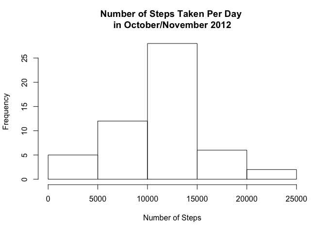
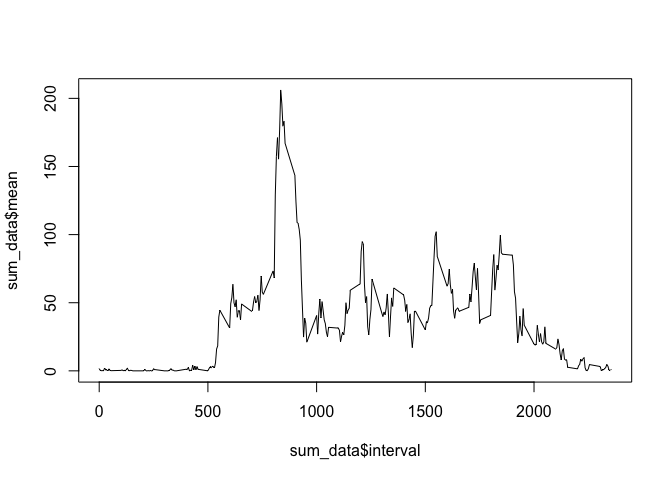
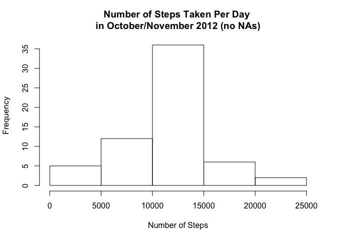
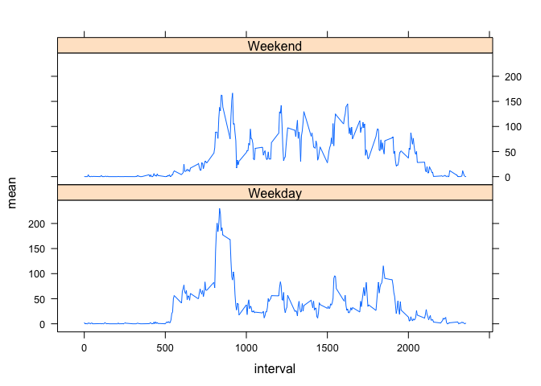

# Reproducible Research: Peer Assessment 1


## Loading and preprocessing the data

```r
data <- read.csv(unz("activity.zip", "activity.csv"))
date <- data$date
```

## What is mean total number of steps taken per day?

```r
totals <- with(data, tapply(steps, date, sum))
hist(totals, main="Number of Steps Taken Per Day \nin October/November 2012", xlab = "Number of Steps")
```

<!-- -->

```r
avg_steps <- mean(totals, na.rm=TRUE)
med_steps <- median(totals, na.rm=TRUE)
```
The mean number of steps taken per day is 1.0766189\times 10^{4}.  
The median number of steps taken per day is 10765.

## What is the average daily activity pattern?

```r
library(dplyr)
```

```
## 
## Attaching package: 'dplyr'
```

```
## The following objects are masked from 'package:stats':
## 
##     filter, lag
```

```
## The following objects are masked from 'package:base':
## 
##     intersect, setdiff, setequal, union
```

```r
group_data <- data %>% group_by(interval)
sum_data <- summarise(group_data, mean=mean(steps, na.rm=TRUE))
plot(sum_data$interval, sum_data$mean, type="l")
```

<!-- -->

```r
max_int <- sum_data$interval[sum_data$mean == max(sum_data$mean)]
```
The interval with the maximum number of steps is 835.

## Imputing missing values

```r
na_num <- sum(is.na(data$steps))
no_nas <- replace(data$steps, is.na(data$steps), sum_data$mean)
data$steps <- no_nas
totals2 <- with(data, tapply(steps, date, sum))
hist(totals2, main="Number of Steps Taken Per Day \nin October/November 2012 (no NAs)", xlab = "Number of Steps")
```

<!-- -->

```r
avg_steps2 <- mean(totals2)
med_steps2 <- median(totals2)
```
There are 2304 missing values in the dataset.  
After replacement of the missing values, the mean and median number of steps taken per day are 1.0766189\times 10^{4} and 1.0766189\times 10^{4}. While these values do not differ much from those computed in Step 1, the histogram is much more tightly peaked around the most frequent totals.  


## Are there differences in activity patterns between weekdays and weekends?

```r
library(lattice)
dow <- weekdays(as.Date(data$date))
new_dow <- factor(dow)
levels(new_dow) <- list(Weekday=c("Monday","Tuesday","Wednesday","Thursday","Friday"),Weekend=c("Saturday","Sunday"))
data$dow <- new_dow
group_dow <- data %>% group_by(interval, dow)
sum_dow <- summarise(group_dow, mean=mean(steps))
xyplot(mean ~ interval | dow, sum_dow, layout=c(1,2), type="l")
```

<!-- -->
